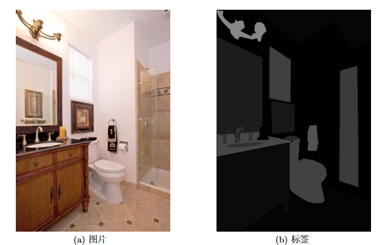
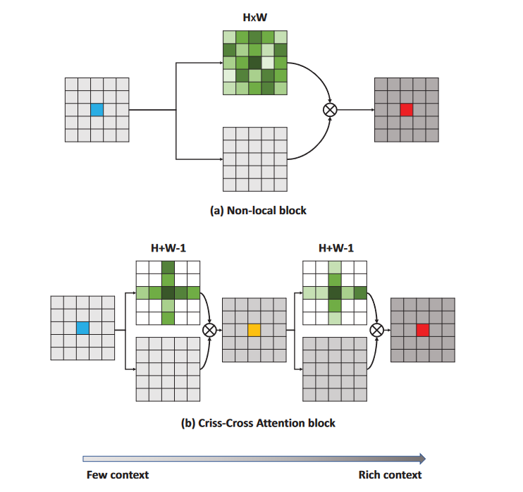
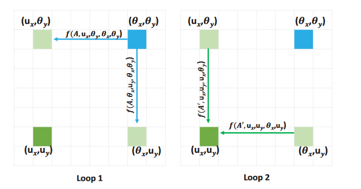
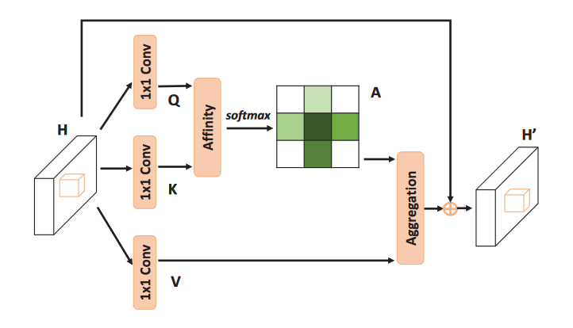

# CCNet: Criss-Cross Attention for Semantic Segmentation @ Jittor
这个仓库是基于Jittor开源平台的'CCNet: Criss-Cross Attention for Semantic Segmentation'[论文](https://github.com/speedinghzl/CCNet)复现版本，并且根据任务要求，实现了以[VAN模型](https://github.com/Visual-Attention-Network/VAN-Jittor)替换原论文中的ResNet101为backbone的版本。

## 论文介绍
### 背景
复现论文任务为语义分割，可视为像素级别上的分类，将属于同一类的像素关联到一个类别标签。

如图1所示，针对左边的样例，语义分割模型输出的结果应为右侧的单通道灰度图，每个像素的值表示其所属的类，从而突出显示出图像中的所有类别及相应位置。

在以往的语义分割工作中，主要存在感受野和计算量问题
* 感受野问题：图像之间距离较远的像素间的相关信息也是有价值的，捕获这些信息，可以更好地对图像进行理解。但卷积核固定的大小，使这种远距离像素间的相关性信息难以被捕获加入到网络中。
* 类似于Attention的Non Local机制，可以在很大程度上解决感受野问题，但却在计算复杂度上受限严重。

本篇论文，正是为了解决下计算复杂度问题。在论文中，作者提出了一种图像信息捕捉方式—— criss-cross attention模块。图2包括了Non-local和Criss-cross attention（以下简称为cca）的简要示意图，不同于Non-Local一次性计算全图的attention，cca机制则是只计算一个点横纵位置的attention信息，即从每个像素点的criss-cross path获取图像的上下文信息。


如果只计算一次横纵位置，按照这种结构，显然可以看出此处获得的上下文信息是局限在横纵轴位置上的，其他位置并没有被关联到。为了解决这个问题，作者在模型中串行了两个cca模块。如下图3，在第一次计算Loop1中，两个浅绿色方块处可获得蓝色方块的信息；重复这个过程，在第二次Loop2中，深绿色方块可获得浅绿色处信息。由此，整个图中任意一个位置，都能与其他所有位置处有关联，从而获得丰富的语义信息。


### 实现细节

cca模块的具体结构如图4。
原始图像经过主干网络提取特征，得到特征图H，其形状为[C × W × H]。H经过三个1×1卷积层，分别生成特征图Q、K以及V，Q、K的形状为[C' × W × H]，V仍为[C × W × H]。为减少计算量，C'大小一般为C的1/8。

接着进行Affinity操作，获得特征图当中每一个像素点与其同行同列像素点的关系。对于W × H大小图片的每个位置u，都可以从Q中得到一个维数为C'的向量 $ Q_{u} $ ，同时我们可以从K中提取与位置u处于同一行、列的向量，构成向量集 $ \Omega_{u} \in R^{(H+W-1)×C'} $。对其中的每个位置向量 $ \Omega_{i,u}, 0<=i<H+W $，计算
$$
d_{i,u} = Q_{u} \Omega^{T}_{i,u}
$$
所有的 $ d_{i,u} $ 构成一个新的特征图，该特征图形状为[(W+H-1) × W × H]，记为D。

而后对D进行softmax操作，得到新的特征图A，同样A形状也是[(W+H-1) × W × H]。

最终进行Aggregation 操作，涉及到A、V、H三个特征图的运算。在第一阶段生成特征图的 $ V \in R^{[C × W × H]}$，我们同样对于每一个位置u，可以在channel轴上得到一个向量集$ \Phi_{i,u} \in R^{[(H+W-1) × C]} $，将这个向量集与生成的A相乘，即完成Aggregation操作。之后再加上原始输入H，得到一个新的特征图H'，其形状为[C × W × H]。
$$
H'_{u} = \sum(A_{i,u}\Phi_{i,u}) + H_{u}
$$
如上三个步骤执行完，即完成一个CCA运算。

### 论文结论
作者在包括cityspace，ADE20K等多种数据集上开展了实验，给出了测试和统计结果、模型超参数以及数据处理细节，并提供了具体的案例分析。在论文中，作者将其与使用Non Local模块的模型等对比，展示了使用cca模块的模型，在miou分数上有不小提升，甚至在一些方面达到了SOTA的结果。之后作者还估算了上述模型的参数量，得出自己所提出的方法，参数量、计算量均小于Non-Local等机制。最后，作者还针对cca模块开展了一系列的消融实验，通过控制cca模块的数量，有力地证明了cca模块的有效性并且串行使用两个cca模块，图片中任一位置即可获得全图的上下文信息。

## 使用方法
### 环境
请参考[Jittor官方文档](https://cg.cs.tsinghua.edu.cn/jittor/download/)安装Jittor
### 训练
下载ADE20K数据集并解压至根目录下，运行命令
```shell
python train.py
```
即可按照默认设置运行。通过命令行参数可设置训练模型时的超参数，具体信息可通过命令
```shell
python train.py --help
```
查看

### 复现结果
methods | mIOU | checkpoint
| ---- | ---- | ----
| ResNet101 + RCCA(R=2) | 41.72 | [链接](https://pan.baidu.com/s/1eT_9ws5a4n8Au_LMRChSDw?pwd=7r55)
| VAN-base + RCCA(R=2) | 41.5 | [链接](https://pan.baidu.com/s/1eT_9ws5a4n8Au_LMRChSDw?pwd=7r55)

